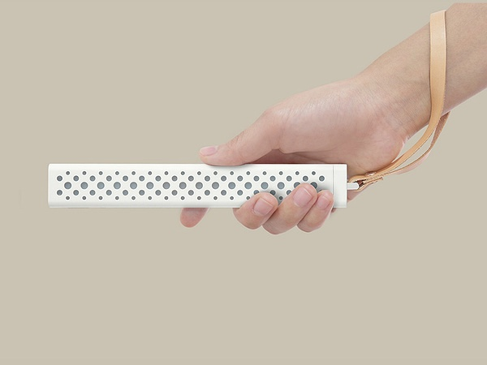
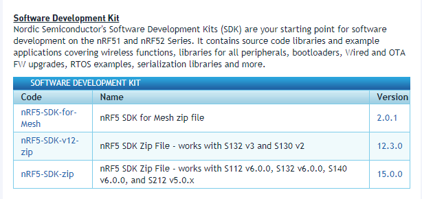
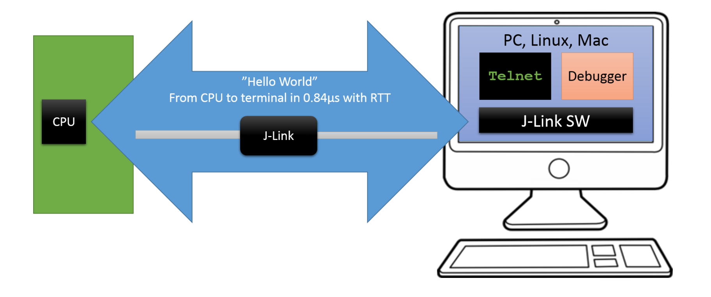
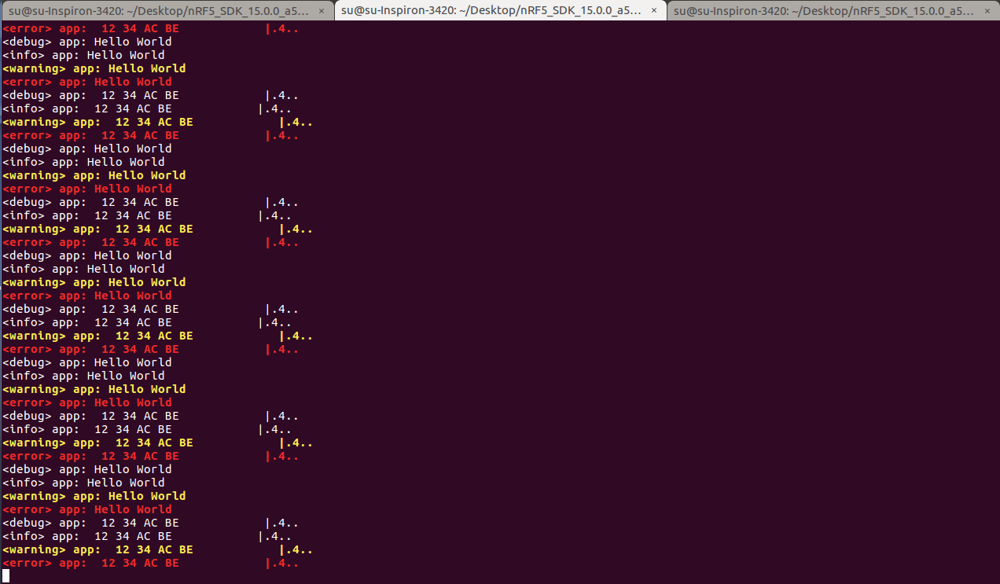

[TOC]

# 1 L-Stick 简介

一次偶然的机会在kickstarter上看到一款智能灯棒**M·Stick**



感觉挺有意思想买一个，马上在亚马逊和淘宝上看了一下，发现这小东西竟然要400块RMB，然后就没有买。

又是一次偶然看到一款蓝牙SOC芯片(nRF52832)这个芯片简直太强大了，发现用这个芯片做那个智能灯棒M·Stick非常适合。然后开始自己做一个类似M·Stick的智能灯棒，姑且命名为 **L-Stick**

**L-Stick**是一个软硬件完全开源的小项目，托管在[https://github.com/codenocold/L-STICK](https://github.com/codenocold/L-STICK)上，本文档会尽量详细的描述开发过程，方便大家快速入门，来一起完善这个小项目，毕竟一个人的力量是有限的。

**L-Stick**的PCB正反面


**L-Stick**硬件电路主要有以下部分：

- 锂电池充放电保护电路

- 锂电池充电电路

- 按键（开关机&交互）

- LDO稳压（RT9193）

- nRF52832

- 16颗RGB灯（WS2812B）

- 三轴加速计（LIS3DH）


基于以上硬件电路的支持再配合相应的软件**L-Stick**除了能实现**M·Stick**所具有的功能外，还可以自由发挥你的想象做很多有意思的应用。比如使用NORDIC推出的蓝牙MESH组网让多个**L-Stick**组成网络做一些联动的灯光效果或把它作为智能家居中的蓝牙智能灯。

开发流程：

- 基本模块的驱动代码
  - 基于**J-Link**的调试信息输出
  - 充电检测、电池电压检测、电源锁定
  - 按键长按开关机&按键单击、双击、三击……
  - RGB灯的驱动
  - 三轴加速计的驱动
- 初步模仿**M·Stick**的几个基本功能
- 低功耗蓝牙通讯应用开发
- 低功耗蓝牙MESH组网应用开发

# 2 nRF52832芯片简介

nRF52832 SoC是一款功能强大，高度灵活的超低功耗多协议SoC，非常适合低功耗蓝牙，ANT和2.4GHz超低功耗无线应用。它和普通的单片机如51、stm32等最大的不同就是内部集成了`2.4GHz无线电收发器`片内外设，由于集成了`2.4GHz无线电收发器`使它能够支持相关的无线通信协议比如低功耗蓝牙，ANT等。

>* 带有浮点运算单元的ARM® Cortex®-M4 32位处理器，工作频率64MHz
>* 从FLASH运行程序EEMBC[^1]CoreMark跑分为215
>* 从FLASH运行程序电流消耗为 58 μA/MHz
>* 从RAM运行程序电流消耗为 51.6 μA/MHz
>* 数据观察点和跟踪（DWT），嵌入式跟踪宏单元（ETM）和仪表跟踪宏单元（ITM）
>* 串行线调试（SWD）
>* 2.4 GHz 无线电收发器
>* 在低功耗蓝牙模式下拥有 -96 dBm 灵敏度
>* 在低功耗蓝牙模式下支持数据传输速率：1 Mbps，2 Mbps
>* -20至+4 dBm TX功率，可以4 dB步进配置
>* 集成片内巴伦（单端RF）[^2]
>* 发送数据时的峰值电流为 5.3 mA（0 dBm）
>* 接收数据时的峰值电流为 5.4 mA 
>* RSSI (1 dB 分辨率)[^3]
>* 灵活的电源管理
>* 1.7 V–3.6 V 供电电压
>* 全自动 LDO[^4] 和 DC / DC 稳压器系统[^5]
>* 使用64 MHz内部振荡器快速唤醒
>* 系统关闭模式下3 V时电流为0.3μA
>* 系统关闭模式下3 V时电流为0.7μA（64KB RAM保留）
>* 内存
>* 512 kB flash/64 kB RAM  **针对nRF52832-QFAA**
>* 256 kB flash/32 kB RAM  **针对nRF52832-QFAB**
>- 适用于 Nordic 公司的 SoftDevice[^6]
>- 支持多种协议栈
>- 类型2近场通信（NFC-A）标签，具有现场唤醒和接近配对功能
>- 12-bit, 200 ksps ADC - 8个可编程增益可配置通道
>- 64 级比较器
>- 15级低功耗比较器用于系统关闭模式下唤醒
>- 温度传感器
>- 32 个通用 IO
>- 拥有DMA的 3x 4-通道脉宽调制单元
>- 数字麦克风输入接口 (PDM)
>- 具有计数器模式的5x 32位定时器
>- 拥有DMA的 3x SPI 主机/从机
>- 2x I2C 兼容主机/从机
>- I2S 支持EasyDMA
>- UART (CTS/RTS) 支持EasyDMA
>- 可编程内部外设连接 `Programmable peripheral interconnect (PPI)`
>- 正交解码器 `Quadrature decoder (QDEC)`
>- AES 硬件加密支持EasyDMA
>- 使用PPI和EasyDMA无需CPU干预的自主外设操作
>- 3x real-time counter (RTC)
>- 芯片封装
>  * QFN48 package, 6 × 6 mm
>  - WLCSP package, 3.0 × 3.2 mm
>
>[^1]: Embedded Microprocessor Benchmark Consortium 嵌入式微处理器基准联盟
>[^2]: 巴伦是平衡不平衡变换器或者说是单端信号和差分信号的转换器
>[^3]: Received Signal Strength Indication 接收的信号强度指示
>[^4]: low dropout regulator 低压差线性稳压器
>[^5]: DC/DC 效率远高于 LDO 但是电源噪声大于 LDO ，选择哪种方式可以根据侧重不同进行选择
>[^6]: Nordic 公司预编译链接的二进制协议栈库文件

# 3 开发前的准备

## 3.1 硬件需求

- 电脑
- J-Link v9
- **L-Stick**

## 3.2 软件准备

- Linux系统（Ubunt16.04 64位）
- nRF52832开发包
- gcc-arm-none-eabi-6-2017-q2-update-linux 编译工具链
- J-Link驱动
- nRF5x-Command-Line-Tools-Linux64

### 3.2.1 安装nRF52832开发包

nRF52832开发包不需要安装，只需要下载解压到你的某个文件夹中就可以了。

进入nordic官网[nRF52832的首页](http://www.nordicsemi.com/eng/Products/Bluetooth-low-energy/nRF52832)选择`DOWNLOADS`向下找到`Software Development Kit`



可以看到有三个可供下载

* nRF5-SDK-for-Mesh：低功耗蓝牙mesh组网的开发包
* nRF5-SDK-v12-zip：12.3.0版本的低功耗蓝牙开发包
* nRF5-SDK-zip：15.0.0版本的低功耗蓝牙开发包

我们目前用不到开发蓝牙MESH，所以直接选择最新版本的 [nRF5-SDK-zip](http://www.nordicsemi.com/eng/nordic/download_resource/59012/71/61722516/116085) 进行下载

下载完成后解压开发包可以看到开发包内的结构如下

````
SDK/
 ├── components      # 一些基本代码库，外设驱动库，工具等
 ├── config          # 存放了不同芯片的配置模板文件
 ├── documentation   # 存放一些基本的文档信息
 ├── examples        # 各种例子的工程源码
 ├── external        # 存放一些第三方的代码库
 ├── external_tools  # 提供了一个CMSIS配置工具软件
 ├── integration     # 提供了一些兼容性代码
 ├── modules         # 关于nrfx的实现，nrfx是对外设驱动库接口的统一抽象，方便用户调用
 ├── license.txt     # 许可声明文件（没什么用）
 ├── nRF5x_MDK_8_16_0_IAR_NordicLicense.msi    # 针对IAR的芯片支持包
 └── nRF5x_MDK_8_16_0_Keil4_NordicLicense.msi  # 针对Keil4的芯片支持包
````
对于开发包各个文件夹内的东西具体有什么意义现在不用深究，当我们用到的时候在这里找到它时会有更好的认识，***但是一定要先看一下 SDK/documentation/release_notes.txt***

```
nRF5 SDK v15.0.0
------------------------
Release Date: Week 12, 2018

Highlights: 
- Full support for nRF52840 and production quality of libraries and examples for this device.
- Support for the new SoftDevices S140, S132, and S112 v6.0.0.
- Peripheral drivers now use nrfx.
- Extensive rework of the DFU functionality.
- Extensive rework of the cryptography library (nrf_crypto).
- USB firmware is now in production quality.
- Serialization of SoftDevices S140, S132, and S112 v6.0.0.
- IEEE 802.15.4 protocol in production quality.
- Included nrf_oberon crypto library with standard Nordic 5-clause license.

The following toolchains/devices have been used for testing and
verification:
- ARM: MDK-ARM version 5.18a
- GCC: GCC ARM Embedded 6.3 2017-q2-update 
- IAR: IAR Workbench 7.80.4 (IAR 8 - see note below)
- SES: SES 3.34
- Linux: Ubuntu 17.04, Kernel 4.10.0.
- Jlink: 6.22g
```

可以看到官方的开发包使用开发环境说明，这也就是我们为什么选择 gcc-arm-none-eabi-6-2017-q2-update-linux 编译工具链，这样可以避免很多开发中由于编译工具链版本不同带来的各种问题。

### 3.2.2 安装gcc-arm-none-eabi

从[https://developer.arm.com/open-source/gnu-toolchain/gnu-rm/downloads](https://developer.arm.com/open-source/gnu-toolchain/gnu-rm/downloads)下载gcc-arm-none-eabi-6-2017-q2-update Linux 64-bit版本，将压缩包解压到 /usr/local/目录下即完成了安装，至于为什么解压到这个路径这也是因为nRF52832开发包的各种例子中的Makefile指定编译工具链的位置就是这里，可以在SDK/components/toolchain/gcc/Makefile.posix文件中看到

```
GNU_INSTALL_ROOT ?= /usr/local/gcc-arm-none-eabi-6-2017-q2-update/bin/
GNU_VERSION ?= 6.3.1
GNU_PREFIX ?= arm-none-eabi
```
当然你也可以解压到其它位置，只需要将这个文件中的`GNU_INSTALL_ROOT`重新指定一下即可。

### 3.2.3 安装J-Link驱动

驱动版本和**J-Link**硬件本身有一定的兼容性，如果烧录出现问题就换一个版本的**J-Link**驱动再次尝试，最终我自己的**J-Link V9**选择了jlink_5.12.6_x86_64.deb[下载地址](https://www.segger.com/downloads/jlink/jlink_5.12.6_x86_64.deb)这个版本。

下载完成后打开Linux终端cd到下载的文件目录下执行 `sudo dpkg -i jlink_5.12.6_x86_64.deb`即可。

### 3.2.4 安装nRF5x-Command-Line-Tools-Linux64

Nordic提供的[nRF5x-Command-Line-Tools-Linux64](http://www.nordicsemi.com/eng/nordic/download_resource/51388/29/68843668/94917) 是一个工具软件，里边包含nrfjprog 和 mergehex两部分，nrfjprog和程序烧录相关，mergehex和HEX文件合并处理有关，下载压缩包后只需要将文件解压到/usr/local/目录下，然后将nrfjprog和mergehex这两个文件夹添加到环境变量即可。

## 3.3 编译一个官方的例子并烧录到芯片

现在就可以通过编译一个nRF52832开发包中提供的随便一个例子并烧录到nRF52832芯片中来检查我们的准备工作是否正确无误。

1. 打开一个终端cd到 SDK/examples/peripheral/blinky/pca10040/blank/armgcc/ 目录下执行`make`

   ```
   ubuntu:~/Desktop/nRF5_SDK_15.0.0_a53641a/examples/peripheral/blinky/pca10040/blank/armgcc$ make
   mkdir _build
   cd _build && mkdir nrf52832_xxaa
   Assembling file: gcc_startup_nrf52.S
   Compiling file: main.c
   Compiling file: boards.c
   Compiling file: app_error.c
   Compiling file: app_error_handler_gcc.c
   Compiling file: app_error_weak.c
   Compiling file: app_util_platform.c
   Compiling file: nrf_assert.c
   Compiling file: nrf_strerror.c
   Compiling file: system_nrf52.c
   Linking target: _build/nrf52832_xxaa.out
      text	   data	    bss	    dec	    hex	filename
      2140	    112	     28	   2280	    8e8	_build/nrf52832_xxaa.out
   Preparing: _build/nrf52832_xxaa.hex
   Preparing: _build/nrf52832_xxaa.bin
   DONE nrf52832_xxaa
   ```

2. 把J-Link通过SW模式接线连接**L-Stick**和电脑

3. 在终端中执行`make erase`对芯片进行全片擦除操作（非必需操作）
  ```
  ubuntu:~/Desktop/nRF5_SDK_15.0.0_a53641a/examples/peripheral/blinky/pca10040/blank/armgcc$ make erase 
  nrfjprog -f nrf52 --eraseall
  Erasing user available code and UICR flash areas.
  Applying system reset.
  ```

4. 在终端中执行`make flash`进行程序烧录，执行完毕后芯片会被复位然后开始运行烧录的新程序

   ```
   ubuntu:~/Desktop/nRF5_SDK_15.0.0_a53641a/examples/peripheral/blinky/pca10040/blank/armgcc$ make flash 
   Flashing: _build/nrf52832_xxaa.hex
   nrfjprog -f nrf52 --program _build/nrf52832_xxaa.hex --sectorerase
   Parsing hex file.
   Erasing page at address 0x0.
   Applying system reset.
   Checking that the area to write is not protected.
   Programing device.
   nrfjprog -f nrf52 --reset
   Applying system reset.
   Run.
   ```

如果以上步骤都可以得到正确的执行则表明我们的准备工作完美的完成了，可以开始我们的正式开发了。

# 4 基本模块的驱动

## 4.1 基于**J-Link**的调试信息输出

### 4.1.1 J-Link RTT 简介

通过RTT，可以从目标微控制器输出信息以非常高的速度向应用程序发送输入而不影响目标微控制器的实时性。

SEGGER RTT可与任何J-Link型号和任何支持的目标处理器一起使用允许后台内存访问，即Cortex-M和RX目标。

RTT支持两个方向的多个通道，向主机上传数据和由主机发送数据到从机，它可以用于不同的目的，为用户提供最大可能的自由。



### 4.1.2 SDK中的Logger module介绍

Logger module是NORDIC提供的一个日志输出的库，主要特性如下：

- 四个打印输出级别 - ERROR, WARNING, INFO, DEBUG可以对打印输出进行过滤
- 格式化字符串输出（类似printf）
- 用于转储数据的专用宏（比如 16进制数据的打印输出或存储）
- 可配置的全局打印输出级别
- 可配置的单个模块的独立打印输出级别
- 可对单个模块或全局的打印输出开关控制
- 可对每条打印输出显示时间戳
- 可以设置单个模块或不同打印级别的输出显示的颜色
- 可以对打印输出添加不同的前缀
- 打印输出延迟处理机制，等到空闲时再进行打印输出
- 日志机制实现和后端输出方法解耦和处理
- 支持多种后端输出方法 RTT， UART
- 基于模块和实例的可选动态（运行时）过滤

Logger module 提供了两种打印输出机制：

- 即时输出
- 空闲输出

**即时输出模式**下当调用打印输出函数时，会马上对输出信息进行处理并交给后端所选输出方式进行输出，虽然后端输出可以对要输出的数据进行缓冲，但是一旦后端执行返回后又可以马上执行前端的打印输出调用，这种处理方式是简单粗暴的不是最优的，还会影响芯片性能，尤其是再中断上下文中使用打印输出的情况下。这种操作不是线程安全的，可能会导致打印输出的信息不对。

**空闲输出模式**下当调用打印输出函数时，指向要打印输出信息的指针会被存储到一个内部缓冲区中，并不会执行具体的输出。当用户认为现在芯片为空闲状态时可以调用相应的处理函数触发真正的打印输出。

使用空闲输出模式有以下几点限制：

- 格式化输出的变量个数不能超过6个

- 所有的打印输出变量被看作为uint32_t类型

- 因为调用打印输出时会把要输出信息的指针存储到缓冲区，所以要输出信息应该是静态的，要不然有可能造成指针指向无效的数据。但是logger module提供了一种机制去克服这个缺点

  例如下边的代码，使用临时变量作为打印输出的信息，是存在问题的

  ``` c
  void foo(void)
  { 
      char string_on_stack[] = "stack";
      //WRONG! by the time the log is processed, variable content will be invalid
      NRF_LOG_INFO("%s",string_on_stack);
  }
  ```

  反之，使用下边的打印输出代码才是正确的

  ``` C
  void foo(void)
  { 
      char string_on_stack[] = "stack";
      //nrf_log_push() copies the string into the logger buffer and returns address from the logger buffer
      NRF_LOG_INFO("%s",nrf_log_push(string_on_stack));
  }
  ```

### 4.1.3 工程建立

进入`SDK/examples/`目录下新建立一个名为L-Stick的文件夹来存储我们要自己编写的代码，然后再在L-Stick文件夹内创建一个名为RTT的文件夹来存储我们本节要创建的代码。

我们从SDK中的blink的例子复制以下文件到我们本节的工程目录RTT下

- SDK/examples/peripheral/blinky/main.c
- SDK/examples/peripheral/blinky/pca10040/blank/armgcc/blinky_gcc_nrf52.ld
- SDK/examples/peripheral/blinky/pca10040/blank/armgcc/Makefile
- SDK/examples/peripheral/blinky/pca10040/blank/config/sdk_config.h

然后打开Makefile文件稍稍改动以下使我们的RTT工程能够正常编译

1. 第5行`SDK_ROOT := ../../../../../..`修改为`SDK_ROOT := ../../..`
2. 第6行 `PROJ_DIR := ../../..`修改为 `PROJ_DIR := ./`
3. 删除第38行整行

然后打开终端cd到我们本节的RTT目录下就可以执行make命令进行编译了。

#### 4.1.3.1 修改sdk_config.h

打开我们在 **4.1.3** 建立的工程目录下的sdk_config.h文件将文件中的内容全部删除，替换为下面的内容

``` c
#ifndef SDK_CONFIG_H
#define SDK_CONFIG_H


// Logger
#define NRF_LOG_ENABLED 1
#define NRF_LOG_STR_FORMATTER_TIMESTAMP_FORMAT_ENABLED 1
#define NRF_LOG_USES_COLORS 1
#define NRF_LOG_COLOR_DEFAULT 0
#define NRF_LOG_ERROR_COLOR 2
#define NRF_LOG_WARNING_COLOR 4
#define NRF_LOG_DEFAULT_LEVEL 4
#define NRF_LOG_DEFERRED 0
#define NRF_LOG_BUFSIZE 1024
#define NRF_LOG_ALLOW_OVERFLOW 1
#define NRF_LOG_USES_TIMESTAMP 0
#define NRF_LOG_TIMESTAMP_DEFAULT_FREQUENCY 32768
#define NRF_LOG_FILTERS_ENABLED 0
#define NRF_LOG_CLI_CMDS 0
#define NRF_LOG_MSGPOOL_ELEMENT_SIZE 20
#define NRF_LOG_MSGPOOL_ELEMENT_COUNT 8

// Log RTT backend
#define NRF_LOG_BACKEND_RTT_ENABLED 1
#define NRF_LOG_BACKEND_RTT_TEMP_BUFFER_SIZE 64
#define NRF_LOG_BACKEND_RTT_TX_RETRY_DELAY_MS 1
#define NRF_LOG_BACKEND_RTT_TX_RETRY_CNT 3

// SEGGER RTT
#define SEGGER_RTT_CONFIG_BUFFER_SIZE_UP 512
#define SEGGER_RTT_CONFIG_MAX_NUM_UP_BUFFERS 2
#define SEGGER_RTT_CONFIG_BUFFER_SIZE_DOWN 16
#define SEGGER_RTT_CONFIG_MAX_NUM_DOWN_BUFFERS 2
#define SEGGER_RTT_CONFIG_DEFAULT_MODE 0

// Block allocator module
#define NRF_BALLOC_ENABLED 1
#define NRF_BALLOC_CLI_CMDS 0
#define NRF_BALLOC_CONFIG_LOG_ENABLED 0
#define NRF_BALLOC_CONFIG_LOG_LEVEL 3
#define NRF_BALLOC_CONFIG_INITIAL_LOG_LEVEL 3
#define NRF_BALLOC_CONFIG_INFO_COLOR 0
#define NRF_BALLOC_CONFIG_DEBUG_COLOR 0
#define NRF_BALLOC_CONFIG_DEBUG_ENABLED 0
#define NRF_BALLOC_CONFIG_HEAD_GUARD_WORDS 1
#define NRF_BALLOC_CONFIG_TAIL_GUARD_WORDS 1
#define NRF_BALLOC_CONFIG_BASIC_CHECKS_ENABLED 0
#define NRF_BALLOC_CONFIG_DOUBLE_FREE_CHECK_ENABLED 0
#define NRF_BALLOC_CONFIG_DATA_TRASHING_CHECK_ENABLED 0

// fprintf function
#define NRF_FPRINTF_ENABLED 1


#endif
```

以上配置选项都是从开发包中其它例子程序提取出来的，对于每个选项的意义可以在[NORDIC官方文档](http://infocenter.nordicsemi.com/index.jsp?topic=%2Fcom.nordic.infocenter.gs%2Fdita%2Fgs%2Fgs.html)中搜索查看。

#### 4.1.3.2 修改Makefile

打开Makefile文件将11行到43行替换为如下代码

``` makefile
# Source files common to all targets
SRC_FILES += \
  $(PROJ_DIR)/main.c \
  $(SDK_ROOT)/modules/nrfx/mdk/gcc_startup_nrf52.S \
  $(SDK_ROOT)/modules/nrfx/mdk/system_nrf52.c \
  $(SDK_ROOT)/components/libraries/atomic/nrf_atomic.c \
  $(SDK_ROOT)/components/libraries/balloc/nrf_balloc.c \
  $(SDK_ROOT)/components/libraries/util/app_util_platform.c \
  $(SDK_ROOT)/components/libraries/experimental_memobj/nrf_memobj.c \
  $(SDK_ROOT)/components/libraries/experimental_log/src/nrf_log_backend_rtt.c \
  $(SDK_ROOT)/components/libraries/experimental_log/src/nrf_log_default_backends.c \
  $(SDK_ROOT)/components/libraries/experimental_log/src/nrf_log_frontend.c \
  $(SDK_ROOT)/components/libraries/experimental_log/src/nrf_log_str_formatter.c \
  $(SDK_ROOT)/components/libraries/experimental_log/src/nrf_log_backend_serial.c \
  $(SDK_ROOT)/external/segger_rtt/SEGGER_RTT.c \
  $(SDK_ROOT)/external/segger_rtt/SEGGER_RTT_Syscalls_GCC.c \
  $(SDK_ROOT)/external/segger_rtt/SEGGER_RTT_printf.c \
  $(SDK_ROOT)/external/fprintf/nrf_fprintf.c \
  $(SDK_ROOT)/external/fprintf/nrf_fprintf_format.c \

# Include folders common to all targets
INC_FOLDERS += \
  $(PROJ_DIR) \
  $(SDK_ROOT)/modules/nrfx \
  $(SDK_ROOT)/modules/nrfx/mdk \
  $(SDK_ROOT)/integration/nrfx \
  $(SDK_ROOT)/components/toolchain/cmsis/include \
  $(SDK_ROOT)/components/drivers_nrf/nrf_soc_nosd \
  $(SDK_ROOT)/components/libraries/atomic \
  $(SDK_ROOT)/components/libraries/balloc \
  $(SDK_ROOT)/components/libraries/delay \
  $(SDK_ROOT)/components/libraries/strerror \
  $(SDK_ROOT)/components/libraries/util \
  $(SDK_ROOT)/components/libraries/experimental_log/src \
  $(SDK_ROOT)/components/libraries/experimental_log \
  $(SDK_ROOT)/components/libraries/experimental_memobj \
  $(SDK_ROOT)/components/libraries/experimental_section_vars \
  $(SDK_ROOT)/external/fprintf \
  $(SDK_ROOT)/external/segger_rtt \
```

这些都是使用我们这个程序要用到的源文件和头文件路径。

#### 4.1.3.3 修改main.c

打开main.c文件将所有内容删除替换为如下代码

```c
#include "nrf_delay.h"
#include "nrf_log.h"
#include "nrf_log_ctrl.h"
#include "nrf_log_default_backends.h"

/**
 * @brief Function for application main entry.
 */
int main(void)
{
    NRF_LOG_INIT(NULL);
    NRF_LOG_DEFAULT_BACKENDS_INIT();

    uint8_t bytes[] = {0x12, 0x34, 0xAC, 0xBE};

    while (true){
        nrf_delay_ms(1000);

        NRF_LOG_DEBUG("Hello World");
        NRF_LOG_INFO("Hello World");
        NRF_LOG_WARNING("Hello World");
        NRF_LOG_ERROR("Hello World");

        NRF_LOG_HEXDUMP_DEBUG(bytes, sizeof(bytes));
        NRF_LOG_HEXDUMP_INFO(bytes, sizeof(bytes));
        NRF_LOG_HEXDUMP_WARNING(bytes, sizeof(bytes));
        NRF_LOG_HEXDUMP_ERROR(bytes, sizeof(bytes));
    }
}
```

以上代码完成每隔1s打印四种输出级别的 Hello World和字节数组的16进制显示。

### 4.1.4 运行RTT

完成以上修改后，打开终端cd到本节RTT目录下执行`make`编译出错了，错误信息如下

```
error: implicit declaration of function 'NRF_LOG_INTERNAL_HEXDUMP_' [-Werror=implicit-function-declaration]
```

出现这种错误可能由以下原因造成：

1. 没有把函数所在的c文件生成.o目标文件
2. 在函数所在的c文件中定义了，但是没有在与之相关联的.h文件中声明

经过在源码中查看发现在`SDK/components/libraries/experimental_log/src/nrf_log_internal.h`文件中的第238行

```c
NRF_LOG_INTERNAL_HEXDUMP_(NRF_LOG_SEVERITY_WARNING, NRF_LOG_SEVERITY_WARNING, p_data, len)
```

`NRF_LOG_INTERNAL_HEXDUMP_`只在这一处出现，又对比`NRF_LOG_HEXDUMP_DEBUG`等函数的实现规律，所以判断应该是库中的小缺陷，这也进一步印证了为什么库文件名命名有个前缀experimental。我们只需要将这句改成下面的样子就可以修复这个小问题

```c
NRF_LOG_INTERNAL_HEXDUMP_MODULE(NRF_LOG_SEVERITY_WARNING, NRF_LOG_SEVERITY_WARNING, p_data, len)
```

现在我们再进行`make`就可以正常编译了，然后执行`make flash`烧录到L-Stick就可以了。

我们另外在打开两个终端窗口

- 在其中一个执行`JLinkRTTClient`，这个就是我们的JLink RTT输出的终端，我们的打印输出稍后将显示在这个终端中。
- 然后我们在另一个终端中执行以下步骤：
  1. JLinkExe		回车	// 启动JLinkExe工具                           
  2. connect          回车        // 连接L-Stick
  3. 回车                                // 使用默认NRF52832_XXAA作为连接设备
  4. s                       回车       // 选择SWD模式
  5. 回车                                // 速度使用默认 4000 KHz

现在切回到JLink RTT输出的终端就可以看到我们打印输出的信息了



## 4.2 电池电压检测、充电检测、电源锁定

### 4.2.1 电池电压检测

电池电压检测采用nRF52832的逐次逼近型模数转换器（SAADC）实现，nRF52832的SAADC支持8个通道，每个通道可以分别配置到芯片的AIN0到AIN7引脚，SAADC的特性如下

> - 8/10/12-bit 分辨率, 通过多重采样可以达到14-bit分辨率
> - 电压检测范伟位0到VDD

在官方的SDK中像这类片内外设的硬件抽象层代码都在 `SDK/modules/nrfx/`文件夹内其中又分为**hal**和**drivers**两个上向层级关系，**hal**层的代码是更直接操作硬件寄存器的**drivers**层是对**hal**层的更加抽象的再次封装，方便大家进行调用。我们在使用某个片内外设时，一般只需要看一下数据手册对这个外设的介绍，看看SDK中的例子，然后再结合这个外设库的文档就可以进行开发了。

#### 4.2.1.1 工程建立

我们把SDK/examples/L-Stick/RTT文件夹复制一份粘贴到L-Stick目录下并改名位Power作为我们本节的工程文件夹。

##### 4.2.1.1.1 修改sdk_config.h

打开sdk_config.h文件，在其中添加下边的配置宏定义

```c
// nrf_strerror
#define NRF_STRERROR_ENABLED 1

// TIMER periperal driver
#define NRFX_TIMER_ENABLED 1
#define NRFX_TIMER0_ENABLED 1

// SAADC peripheral driver
#define NRFX_SAADC_ENABLED 1

// PPI peripheral allocator
#define NRFX_PPI_ENABLED 1
```

上边配置模块就是我们要用到的模块。

##### 4.2.1.1.2 修改Makefile

打开Makefile文件，将SRC_FILES 和 INC_FOLDERS变量修改为如下代码

```makefile
# Source files common to all targets
SRC_FILES += \
  $(PROJ_DIR)/main.c \
  $(SDK_ROOT)/modules/nrfx/mdk/gcc_startup_nrf52.S \
  $(SDK_ROOT)/modules/nrfx/mdk/system_nrf52.c \
  $(SDK_ROOT)/components/libraries/atomic/nrf_atomic.c \
  $(SDK_ROOT)/components/libraries/balloc/nrf_balloc.c \
  $(SDK_ROOT)/components/libraries/util/app_util_platform.c \
  $(SDK_ROOT)/components/libraries/experimental_memobj/nrf_memobj.c \
  $(SDK_ROOT)/components/libraries/experimental_log/src/nrf_log_backend_rtt.c \
  $(SDK_ROOT)/components/libraries/experimental_log/src/nrf_log_default_backends.c \
  $(SDK_ROOT)/components/libraries/experimental_log/src/nrf_log_frontend.c \
  $(SDK_ROOT)/components/libraries/experimental_log/src/nrf_log_str_formatter.c \
  $(SDK_ROOT)/components/libraries/experimental_log/src/nrf_log_backend_serial.c \
  $(SDK_ROOT)/external/segger_rtt/SEGGER_RTT.c \
  $(SDK_ROOT)/external/segger_rtt/SEGGER_RTT_Syscalls_GCC.c \
  $(SDK_ROOT)/external/segger_rtt/SEGGER_RTT_printf.c \
  $(SDK_ROOT)/external/fprintf/nrf_fprintf.c \
  $(SDK_ROOT)/external/fprintf/nrf_fprintf_format.c \
  \
  \
  $(SDK_ROOT)/modules/nrfx/drivers/src/nrfx_ppi.c \
  $(SDK_ROOT)/modules/nrfx/drivers/src/nrfx_saadc.c \
  $(SDK_ROOT)/modules/nrfx/drivers/src/nrfx_timer.c \
  $(SDK_ROOT)/components/libraries/util/app_error.c \
  $(SDK_ROOT)/components/libraries/util/app_error_weak.c \
  $(SDK_ROOT)/components/libraries/strerror/nrf_strerror.c \


# Include folders common to all targets
INC_FOLDERS += \
  $(PROJ_DIR) \
  $(SDK_ROOT)/modules/nrfx \
  $(SDK_ROOT)/modules/nrfx/mdk \
  $(SDK_ROOT)/integration/nrfx \
  $(SDK_ROOT)/components/toolchain/cmsis/include \
  $(SDK_ROOT)/components/drivers_nrf/nrf_soc_nosd \
  $(SDK_ROOT)/components/libraries/atomic \
  $(SDK_ROOT)/components/libraries/balloc \
  $(SDK_ROOT)/components/libraries/delay \
  $(SDK_ROOT)/components/libraries/strerror \
  $(SDK_ROOT)/components/libraries/util \
  $(SDK_ROOT)/components/libraries/experimental_log/src \
  $(SDK_ROOT)/components/libraries/experimental_log \
  $(SDK_ROOT)/components/libraries/experimental_memobj \
  $(SDK_ROOT)/components/libraries/experimental_section_vars \
  $(SDK_ROOT)/external/fprintf \
  $(SDK_ROOT)/external/segger_rtt \
  \
  \
  $(SDK_ROOT)/modules/nrfx/hal \
  $(SDK_ROOT)/modules/nrfx/drivers/include \
```

其实就是添加了本节要用的的源文件和头文件包含路径。

##### 4.2.1.1.3 修改main.c

打开main.c文件将代码修改为如下代码

```c
#include "nrf_delay.h"
#include "nrf_log.h"
#include "nrf_log_ctrl.h"
#include "nrf_log_default_backends.h"
#include "nrfx_saadc.h"
#include "nrfx_ppi.h"
#include "nrfx_timer.h"


#define ADC_2_MILIVOLT(ADC)   (ADC*1000/4551)

static const nrfx_timer_t    m_timer = NRFX_TIMER_INSTANCE(0);
static nrf_saadc_value_t     saadc_value;
static nrf_ppi_channel_t     m_ppi_channel;


void timer_handler(nrf_timer_event_t event_type, void * p_context)
{

}

void saadc_callback(nrfx_saadc_evt_t const * p_event)
{
    ret_code_t err_code;
    static uint8_t calib_cnt = 0;

    if(p_event->type == NRFX_SAADC_EVT_DONE){
        if(calib_cnt ++ > 100){
            calib_cnt = 0;
            nrfx_saadc_calibrate_offset();
        }else{
            err_code = nrfx_saadc_buffer_convert(&saadc_value, 1);
            APP_ERROR_CHECK(err_code);
            NRF_LOG_INFO("milivolt: %d mV", ADC_2_MILIVOLT(p_event->data.done.p_buffer[0]));
        }
    }
}

void saadc_init(void)
{
    ret_code_t err_code;
    nrfx_saadc_config_t saadc_config = {
        .resolution         = NRF_SAADC_RESOLUTION_14BIT,
        .oversample         = NRF_SAADC_OVERSAMPLE_DISABLED,
        .interrupt_priority = 7,
        .low_power_mode     = false,  
    };

    nrf_saadc_channel_config_t channel_config = {                                                   \
        .resistor_p = NRF_SAADC_RESISTOR_DISABLED,
        .resistor_n = NRF_SAADC_RESISTOR_DISABLED,
        .gain       = NRF_SAADC_GAIN1_6,
        .reference  = NRF_SAADC_REFERENCE_INTERNAL,
        .acq_time   = NRF_SAADC_ACQTIME_40US,
        .mode       = NRF_SAADC_MODE_SINGLE_ENDED,
        .burst      = NRF_SAADC_BURST_DISABLED,
        .pin_p      = (nrf_saadc_input_t)(NRF_SAADC_INPUT_AIN5),
        .pin_n      = NRF_SAADC_INPUT_DISABLED,
    };

    err_code = nrfx_saadc_init(&saadc_config, saadc_callback);
    APP_ERROR_CHECK(err_code);

    err_code = nrfx_saadc_channel_init(5, &channel_config);
    APP_ERROR_CHECK(err_code);

    // Block Read
    nrfx_saadc_sample_convert(5, &saadc_value);
    NRF_LOG_INFO("Start up Block Read milivolt: %d mV", ADC_2_MILIVOLT(saadc_value));
}

void saadc_sampling_event_init(void)
{
    ret_code_t err_code;

    nrfx_timer_config_t timer_cfg = {
        .frequency          = NRF_TIMER_FREQ_500kHz,
        .mode               = NRF_TIMER_MODE_TIMER,
        .bit_width          = NRF_TIMER_BIT_WIDTH_32,
        .interrupt_priority = 7,
        .p_context          = NULL,
    };

    err_code = nrfx_timer_init(&m_timer, &timer_cfg, timer_handler);
    APP_ERROR_CHECK(err_code);

    /* setup m_timer for compare event every 1000ms */
    uint32_t ticks = nrfx_timer_ms_to_ticks(&m_timer, 1000);
    nrfx_timer_extended_compare(&m_timer,
                                   NRF_TIMER_CC_CHANNEL0,
                                   ticks,
                                   NRF_TIMER_SHORT_COMPARE0_CLEAR_MASK,
                                   false);
    nrfx_timer_enable(&m_timer);

    uint32_t timer_compare_event_addr = nrfx_timer_compare_event_address_get(&m_timer, NRF_TIMER_CC_CHANNEL0);
    uint32_t saadc_sample_task_addr   = nrfx_saadc_sample_task_get();

    /* setup ppi channel so that timer compare event is triggering sample task in SAADC */
    err_code = nrfx_ppi_channel_alloc(&m_ppi_channel);
    APP_ERROR_CHECK(err_code);

    err_code = nrfx_ppi_channel_assign(m_ppi_channel,
                                          timer_compare_event_addr,
                                          saadc_sample_task_addr);
    APP_ERROR_CHECK(err_code);
}

void saadc_sampling_event_enable(void)
{
    ret_code_t err_code = nrfx_saadc_buffer_convert(&saadc_value, 1);
    APP_ERROR_CHECK(err_code);

    err_code = nrfx_ppi_channel_enable(m_ppi_channel);
    APP_ERROR_CHECK(err_code);
}

/**
 * @brief Function for application main entry.
 */
int main(void)
{
    NRF_LOG_INIT(NULL);
    NRF_LOG_DEFAULT_BACKENDS_INIT();

    saadc_init();
    saadc_sampling_event_init();
    saadc_sampling_event_enable();

    while (true){

    }
}
```

#### 4.2.1.2 运行电池电压检测

将代码编译烧录到芯片按照前边讲的RTT调试打开JLinkRTTClient和JLinkExe并连接后，在JLinkExe中输入`r`回车复位芯片，输入`g`回车启动程序，（这些命令都是JLinkExe的调试命令，想进一步了解学习的话可以看JLink的文档）就可以完整的看到我们在程序中的输出信息，如下图


代码实现的功能如下

- 初始化logger
- 初始化saadc
- 初始化定时器并通过PPI连接定时器每1s触发ADC转换

当ADC转换完成会进入`saadc_callback`函数，在`saadc_callback`函数中会打印输出当前ADC采集的电压值（mV），当每转换100次，进行一次saad校准。

### 4.2.2 充电检测

充电检测我们采用通过nRF52832 IO口检测充电芯片TP4056的两个状态IO来进行冲电检测，TP4056手册上的状态IO说明如下图


## 4.3 按键长按、单击、双击、三击……


## 4.4 RGB灯的驱动


## 4.5 三轴加速计的驱动


# 5 初步模仿**M·Stick**的几个基本功能

# 6 低功耗蓝牙通讯应用开发

# 7 低功耗蓝牙MESH组网应用开发

